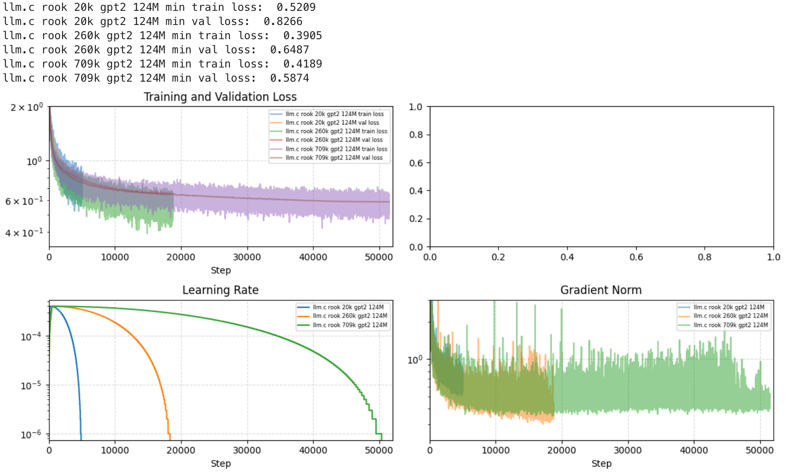
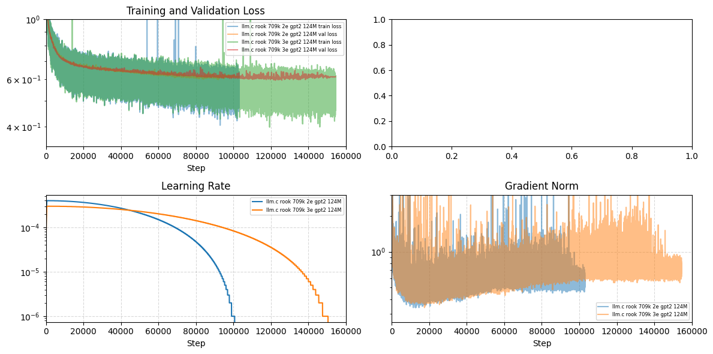
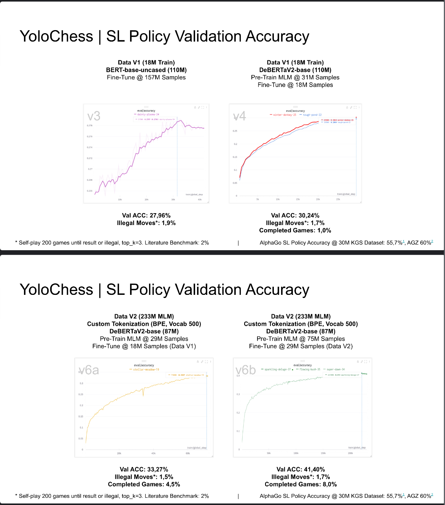

# ROOK: Reasoning Over Organized Knowledge

A chess-playing transformer model trained on a synthetic dataset with chain-of-thought evaluation from Stockfish.

## setup
- tested: linux (ubuntu 22.04), python 3.11, nvidia-gpu, cuda 12.4, cudnn 9.3, stockfish 16.1
- download and unpack stockfish binary from [here](https://github.com/official-stockfish/Stockfish)
- set env STOCKFISH_PATH to binary with `export $STOCKFISH_PATH=/path/to/stockfish-binary`
- create and activate a clean python virtual environment / conda environment
- clone this repo `git clone https://github.com/jorahn/rook.git`
- cd into the repo folder `cd rook` and run `bash setup.sh`
  - this will clone [llm.c](https://github.com/karpathy/llm.c) at a specific commit
  - copies files for dataset generation, training and evaluation of ROOK into llm.c
- finalize environment setup for llm.c with dependencies like cuda, cudnn or cudnn-frontend and nccl as per llm.c docs
- `bash run.sh` for 
  - basic data gen (~20k samples, half human and selfplay, ~30 mins on 6 cores)
  - train minimal gpt2-small model on one GPU for 5000 steps (2 epochs) with bs=1 to val-loss ~0.83
  - convert model.bin to hf
  - run accuracy eval (32% invalid completions, 16% legal best moves, 0.6% correct best moves, 17.6% legal top 5 moves, 1.4% correct top 5 moves with greedy decoding)
  - WIP: run match against stockfish level 0
  - run self-play eval (avg ~3.5 legal half-moves in 50 self-play games with sampling: topk=5, temp=0.6)

### data scaling & preliminary benchmarks

|  FEN Samples | Steps (Epochs) | Val-Loss | Best Move Accuracy | Top 5 Move Accuracy | Selfplay Legal Half-Moves (Illegal %) |
|--------------|----------------|----------|--------------------|---------------------|---------------------------------------|
|         20k  |    5000 (2)    |  0.8268  |       0.6%         |        1.4%         |            3.5 (28.3%)                |
|        260k  |   18752 (1)    |  0.6547  |       3.8%         |       10.6%         |           14.2 (7.0%)                 |
|        709k  |   51481 (1)    |**0.5875**|       7.4%         |       19.3%         |           17.7 (5.6%)                 |
|        709k  |  102962 (2)    |  0.5988  |       7.8%         |       25.0%         |         **23.6 (4.2%)**               |
|        709k  |  154443 (3)    |  0.5953  |     **8.8%**       |     **28.2%**       |         **23.5 (4.3%)**               |
| 679k (no ME) |   32323 (1)    |  6.3259  |       8.4%         |         -           |            9.4 (10.7%)                |

training:  

preliminary benchmarks: 
- 28 legal half-moves after 2.4m examples (presumably full games) with GPT2-1.5B [src](https://x.com/theshawwn/status/1212619327347871744)  
- unpublished results 2022: BERT-style models (some pre-trained on FEN MLM) trained on next-move (text) classification:

## generate dataset
1. generate a text-dataset with stockfish (very cpu intense)
   1. to generate a text-dataset from human chess positions run `llm.c/dev/data/rook/generate_lichess.py -p $STOCKFISH_PATH`
   2. to generate a text-dataset from stockfish self-play positions run `llm.c/dev/data/rook/generate_selfplay.py -p $STOCKFISH_PATH`
3. to generate llm.c train and valid files (.bin) from text-datasets run `llm.c/dev/data/rook.py`

## run training
- modify / run `llm.c/scripts/run_gpt2_124M_rook.sh`
- for monitoring, run `jupyter lab` in `llm.c/dev/` and open `vislog2_rook.ipynb`

## evaluation
- run `llm.c/dev/eval/export_hf.py` to convert model.bin to huggingface gpt2 safetensor + tokenizer
- run `llm.c/dev/eval/rook_accuracy.py` to evaluate the converted model move accuracy against the validation dataset
- run `llm.c/dev/eval/rook_selfplay.py` to play the converted model against itself, observe number of moves before illegal move
- run `llm.c/dev/eval/rook_vs_stockfish.py` to play the converted model against Stockfish 16.1 (level 0 or higher) - currently it loses all games due to invalid moves or checkmate
- run `llm.c/dev/eval/rook_analysis.py` to provide an FEN (e.g. from a human game) and get the model evaluation for it
