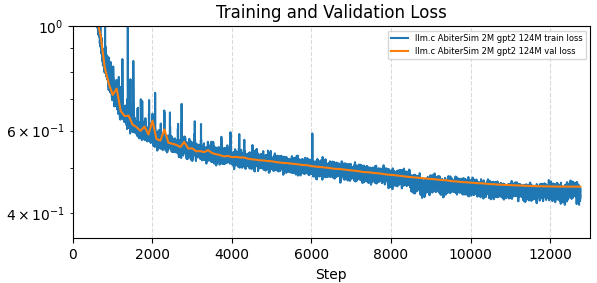

This repo contains code for:
- [**ROOK**](#rook-reasoning-over-organized-knowledge): A chess-playing language model trained on a synthetic dataset with chain-of-thought evaluation from Stockfish.
- [**ArbiterSim**](#arbitersim): A language model trained to simulate a chess environment from rollouts of ROOK self-play.
- [**RookWorld**](#rookworld--rookworld-evol): A single language model trained to generate both the ROOK policy and the ArbiterSim Environment through different prompt prefixes.
- **RookWorld Evol**: Filter winning rollouts from self-play of the RookWorld Policy in the RookWorld Environment and continue training to achieve stepwise Policy self-improvement.

Thanks to the developers of these awesome dependencies: 
- [karpathy/llm.c](https://github.com/karpathy/llm.c) LLMs in simple, pure C/CUDA
- [official-stockfish/Stockfish](https://github.com/official-stockfish/Stockfish) A free and strong UCI chess engine
- [niklasf/python-chess](https://github.com/niklasf/python-chess) a chess library for Python
- [huggingface/datasets](https://github.com/huggingface/datasets) 🤗 The largest hub of ready-to-use datasets for ML models

---

# ROOK: Reasoning Over Organized Knowledge
A chess-playing language model trained on a synthetic dataset with chain-of-thought evaluation from Stockfish.

## basic ROOK setup
- tested: linux (ubuntu 22.04), python 3.11, nvidia-gpu, cuda 12.4, cudnn 9.3, stockfish 16.1
- download and unpack stockfish binary from [here](https://github.com/official-stockfish/Stockfish)
- set env STOCKFISH_PATH to binary with `export $STOCKFISH_PATH=/path/to/stockfish-binary`
- create and activate a clean python virtual environment / conda environment
- clone this repo `git clone https://github.com/jorahn/rook.git`
- cd into the repo folder `cd rook` and run `bash setup.sh`
  - this will clone [llm.c](https://github.com/karpathy/llm.c) at a specific commit
  - copies files for dataset generation, training and evaluation of ROOK into llm.c
- finalize environment setup for llm.c with dependencies like cuda, cudnn or cudnn-frontend and nccl as per llm.c docs
- `bash run.sh` for 
  - basic data gen (~20k samples, half human and selfplay, ~30 mins on 6 cores)
  - train minimal gpt2-small model on one GPU for 5000 steps (2 epochs) with bs=1 to val-loss ~0.83
  - convert model.bin to hf
  - run [google/BIG-bench checkmate in one](https://github.com/google/BIG-bench/tree/main/bigbench/benchmark_tasks/checkmate_in_one) task eval (TODO: during training instead of hellaswag in llm.c)
     - consider that the training data generally does not contain mate-moves, as strong players usually resign beforehand and the stockfish engine games are often a draw and capped at move 60
  - run accuracy eval (32% invalid completions, 16% legal best moves, 0.6% correct best moves, 17.6% legal top 5 moves, 1.4% correct top 5 moves with greedy decoding)
  - run 50 matches against stockfish level 0
  - run self-play eval (avg ~3.5 legal half-moves in 50 self-play games with sampling: topk=5, temp=0.6)

## benchmarks & data scaling

| FEN Samples  | Steps (Epochs) | Val-Loss | [BIG-bench Mate in One](https://github.com/google/BIG-bench/tree/main/bigbench/benchmark_tasks/checkmate_in_one) Accuracy | Best Move Val Accuracy | Top 5 Move Val Accuracy | Selfplay Legal Half-Moves (Illegal %) |
|--------------|----------------|----------|-------------------------------|--------------------|---------------------|---------------------------------------|
| 20k          | 5,000 (2)      |  0.8268  |   0.0%                        |   0.6%             |    1.4%             |    3.5 (28.3%)                        |
| 260k         | 18,752 (1)     |  0.6547  |   4.7%                        |   3.8%             |   10.6%             |   14.2 (7.0%)                         |
| 709k         | 51,481 (1)     |  0.5875  |   4.8%                        |   7.4%             |   19.3%             |   17.7 (5.6%)                         |
| 709k         | 102,962 (2)    |  0.5988  |   5.5%                        |   7.8%             |   25.0%             |   23.6 (4.2%)                         |
| 709k         | 154,443 (3)    |  0.5953  |   7.0%                        |   8.8%             |   28.2%             |   23.5 (4.3%)                         |
| 679k (no ME) | 32,323 (1)     |  6.3259  |   4.1%                        |   8.4%             |   -                 |    9.4 (10.7%)                        |
| 679k (no M)  | 32,323 (1)     |  2.9636  |   4.8%                        |   7.0%             |   -                 |   10.1 (9.9%)                         |
| [5M](https://huggingface.co/datasets/lfsm/rook-5m)|11,646 (1) |  0.5779  |   9.0%    |  12.0%  |   30.6%            |   28.8 (3.5%)                         |
| [5M](https://huggingface.co/datasets/lfsm/rook-5m)|34,932 (3)    |**0.5629**| **11.5%** |**13.4%** | **39.6%**           | **41.4 (2.4%)**                        |

*1 FEN sample ~150 Tokens -> ROOK 5M ~770M Tokens

training:  

## generate dataset
1. generate a text-dataset with stockfish (very cpu intense)
   1. to generate a text-dataset from human chess positions run `llm.c/dev/data/rook/generate_lichess.py -p $STOCKFISH_PATH`
   2. to generate a text-dataset from stockfish self-play positions run `llm.c/dev/data/rook/generate_selfplay.py -p $STOCKFISH_PATH`
3. to generate llm.c train and valid files (.bin) from text-datasets run `llm.c/dev/data/rook.py`

## run training
- modify / run `llm.c/scripts/run_gpt2_124M_rook.sh`
- for monitoring, run `jupyter lab` in `llm.c/dev/` and open `vislog2_rook.ipynb`

## evaluation
- run `llm.c/dev/eval/rook_eval_parallel.sh` to do this in one step:
  - run `llm.c/dev/eval/export_hf.py` to convert model.bin to huggingface gpt2 safetensor + tokenizer
  - run `llm.c/dev/eval/rook_bb-cio.py` to evaluate against BIG-bench Checkmate in One task
  - run `llm.c/dev/eval/rook_accuracy.py` to evaluate the converted model move accuracy against the validation dataset
  - run `llm.c/dev/eval/rook_selfplay.py` to play the converted model against itself, observe number of moves before illegal move
  - run `llm.c/dev/eval/rook_vs_stockfish.py` to play the converted model against Stockfish 16.1 (level 0 or higher) - currently it loses all games due to invalid moves or checkmate
- run `llm.c/dev/eval/rook_analysis.py` to provide an FEN (e.g. from a human game) and get the model evaluation for it

---

# ArbiterSim
A language model trained to simulate a chess environment from rollouts of ROOK self-play.

## benchmarks
| Train Samples | Invalid Completions | Next State Accuracy | Next State norm. lev. Distance | Reward Accuracy | Reward MAE | Terminated Accuracy | Truncated Accuracy |
|---------------|---------------------|---------------------|--------------------------------|-----------------|------------|---------------------|--------------------|
| [2M](https://huggingface.co/datasets/jrahn/arbiter_2m) | 0% | 92.3% | 99.76% | 98.93% | 0.0098 | 99.04% | 99.89% |

***ROOK 5M x 3E** can take > 50 consecutive legal actions (half-moves) in **ArbiterSim 2M** (validity of actions and states supervised by python-chess)

training:

## generate dataset
1. to generate and capture rollout logs from ROOK self-play run `llm.c/dev/data/arbiter/generate_rollouts.py`
2. to generate a text-dataset from the logs run `llm.c/dev/data/arbiter/make_dataset.py`
3. to generate llm.c train and valid files (.bin) from text-datasets run `llm.c/dev/data/arbiter.py`

## run training
- modify / run `llm.c/scripts/run_gpt2_124M_arbiter_2m_3e.sh`
- for monitoring, run `jupyter lab` in `llm.c/dev/` and open `vislog2_rook.ipynb`

## evaluation
- run `llm.c/dev/eval/export_hf.py` to convert model.bin to huggingface gpt2 safetensor + tokenizer
- run `llm.c/dev/eval/arbiter_accuracy.py` to run multiple evaluations against the arbiter-validation set

---

# RookWorld & RookWorld Evol

## generate dataset
1. to generate llm.c train and valid files (.bin) from interleaving existing rook- & arbiter-datasets run `llm.c/dev/data/rookworld.py`

## run training
- modify / run `llm.c/scripts/run_gpt2_124M_rookworld_7m_3e.sh`
- for monitoring, run `jupyter lab` in `llm.c/dev/` and open `vislog2_rook.ipynb`
